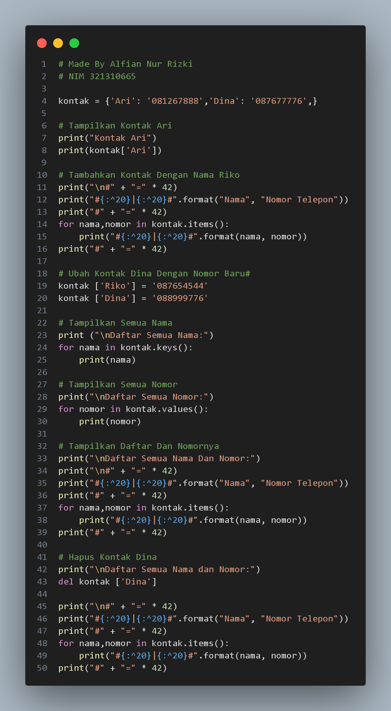

<h1>Praktikum 5</h1>

<h1>Latihan 1</h1>

+ 
Buat Dictionary daftar kontak 

+ 
 Nama sebagai key, dan nomor sebagai value 

  
 # Nama | Nomor Telepon #

  
 #===============#

  
 #  Ari |  081267888    #

  
 # Dina |  087677776    #

   
+ 
Tampilkan kontaknya Ari 

+ 
Tambah kontak baru dengan nama Riko, nomor 087654544

+ 
Ubah kontak Dina dengan nomor baru 088999776

+ 
Tampilkan semua Nama

+ 
Tampilkan semua Nomor

+ 
Tampilkan daftar Nama dan nomornya

+ 
Hapus kontak Dina.

<h1>Tampilan Program Dictionary Latihan 1</h1>

<h1>Tampilan Output Program</h1>

